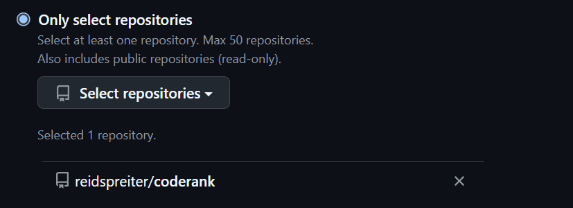

<div align="center">

# Coderank


</div>

<p align="center">
 Curious how many semicolons you typed last week? What about double quotes over the past five years? Want to visualize all your coding data in one place from anywhere? Present your typing prowess on your GitHub profile? This extension is for you.
    <br>
    <br>
    <a href="https://github.com/reidspreiter/coderank/issues/new?assignees=&labels=enhancement&projects=&template=feature_request.md&title=">Request a Feature</a>
 .
    <a href="https://github.com/reidspreiter/coderank/issues/new?assignees=&labels=bug&projects=&template=bug_report.md&title=">Report a Bug</a>
</p>

## Installation

With VS Code open, search for `coderank` in the extension panel (`Ctrl+Shift+X` on Windows/Linux or `Cmd(⌘)+Shift+X` on MacOS) and click install.

OR

With VS Code open, launch VS Code Quick Open (`Ctrl+P` on Windows/Linux or `Cmd(⌘)+P` on MacOS), paste the following command, and press enter:

```
ext install reidspreiter.coderank
```

OR

Install this extension from the VS Code Marketplace (coming soon)

## Using Coderank

Thank you for installing Coderank! This document is the best way to get started, and a video presentation is available if needed (coming soon).

### Explorer Panel

Most interactions with Coderank occur in the added explorer panel.


This panel includes dropdowns for project and local data, and the bottommost item displays the current remote rank.

Project data is stored in your current window of VS Code, local data is saved to your local storage, and remote data aside is stored in your remote Coderank repository.

Each dropdown includes the following:


- `Added`: amount of characters added over time via typing, pasting, typing with multiple cursors, etc.

- `Deleted`: amount of characters deleted over time via pressing backspace, mass deleting, deleting with multiple cursors, etc.

- `Total`: `Added` minus `Deleted`

- `Character Count`: Amount of times each character has been pressed

- `Rank`: 1 rank is equal to 10,000 coding actions. While `Added` and `Deleted` account for mass editing actions, `Rank` does not. Both typing the letter 'i' and pasting one million characters equal 0.0001 rank.

### Project Data

Each instance of VS Code is initialized with new project data. When a VS Code window is closed, project data is _deleted_.

Project data is empty at first, but updates automatically after a set amount of typing actions. Project data can also be manually updated by clicking the refresh button in the top right of the panel.


Coderank includes checks to prevent events from being wrongfully tracked or ignored. However, a user's extensions and other unknown factors could slip by these checks. If an issue occurs, please [report the bug](https://github.com/reidspreiter/coderank/issues/new?assignees=&labels=bug&projects=&template=bug_report.md&title=).


### Local Data

When any workspace file is saved, project data is automatically saved to VS Code's global filesystem at: 

```
<Path-to-VS-Code>/User/globalStorage/reidspreiter.coderank/
```

Project data can also be manually saved to local storage by clicking the local storage button in the top right of the panel.


All VS Code windows contribute data to the same location. Once project data is saved, it is removed from the project section of the Coderank panel and reflected in the local section.

Coderank organizes data by week, creating a new `coderank<YYYY>.json` file for each year. Coderank also tracks programming languages used while typing, and organizes data by language within each week.

Please _avoid editing these files_, or you may experience problems with your extension and potentially lose data.

A compressed backup file is updated every week. If needed, an available backup can be loaded via the `coderank.loadBackup` command which is also accessible through the `more actions...` section of the panel.


### Remote Data

Local data can be pushed to a remote GitHub repository. If you code on different machines at home and work, you can combine data from multiple computers!

Coderank implements a basic web application in your repository to display data with interactive graphs and charts. Feel free to edit this and make it your own! (coming soon)

You can host your web app with [GitHub Pages](https://pages.github.com/) or other resources so anyone viewing your profile can see your typing achievements.

#### Pushing to GitHub

1. [Create a free GitHub account](https://github.com/).

2. [Create a new repository](https://docs.github.com/en/repositories/creating-and-managing-repositories/quickstart-for-repositories) to store your coderank data. Name it whatever you'd like!

3. Create a GitHub Personal Access Token (PAT). View [this GitHub resource](https://docs.github.com/en/authentication/keeping-your-account-and-data-secure/managing-your-personal-access-tokens#creating-a-fine-grained-personal-access-token), or the [Creating a PAT](#creating-a-pat) section of this document for a Coderank-specific introduction.

4. Make note of the branch names in your repository. Pushing to `main` or `master` is encouraged, but Coderank allows you to push to any branch, as long as it exists.

Upon completing these steps, you are ready to push to your repository!

Press the remote repository button in the top right of the Coderank panel.


You will be prompted to enter your GitHub username, PAT, repository name, and branch name.

Once these fields are supplied, Coderank clones your repository, adds local data, creates a `total.json` file, which contains the sum of data from each year, not including `Character Count`. Then, Coderank pushes the changes and deletes all local files and backups if successful.

By default, Coderank does not save username or PAT credentials. However, storing and retrieving these via VS Code's extension secrets can be enabled with the `coderank.saveCredentials` configuration option.

## Settings Keys

Coderank can be customized by updating the following settings keys in VS Code's `settings.json`.

| Key | Default | Description |
|-----|---------|-------------|
| `coderank.saveCredentials` | `false` | Save GitHub username and PAT
| `coderank.refreshRate` | `100` | Automatically refresh project data every `X` characters. Set to 0 to disable automatic refresh |
| `coderank.trackCharacters` | `true` | Track character values and populate a `Characters Pressed` field |
| `coderank.autoStore` | `true` | Automatically add project data to local storage on document save |
| `coderank.loadLocalOnStart` | `true` | Load data from local storage when a new window is opened |
| `coderank.debug` | `false` | Logs events to the console for debug and development purposes |

## Creating a PAT

Personal access tokens (PATs) allow Coderank to access GitHub resources on your behalf. Moreover, PATs are secure and can limit Coderank's permissions and the repositories it can access.

Creating a PAT is easy and shouldn't take longer than five minutes. Follow [these steps](https://docs.github.com/en/authentication/keeping-your-account-and-data-secure/managing-your-personal-access-tokens#creating-a-fine-grained-personal-access-token) from the GitHub Docs to get started.

Regarding step 11:
>Under **Repository access**, select which repositories you want the token to access.



Allow your PAT to only access your Coderank repository.

Regarding step 13:
>Under Permissions, select which permissions to grant the token.


Grant your PAT the **Repository permission** of read-and-write access to **Contents**. Your PAT will be given read-only access to **Metadata** by default.

Once you have created your PAT, you are all set! Just make sure to save it somewhere so you have it ready to supply to Coderank when you push local fields to your repository.
