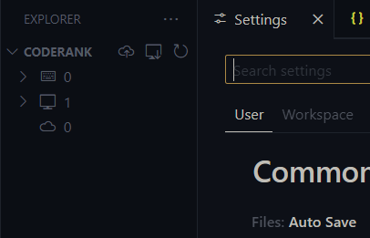
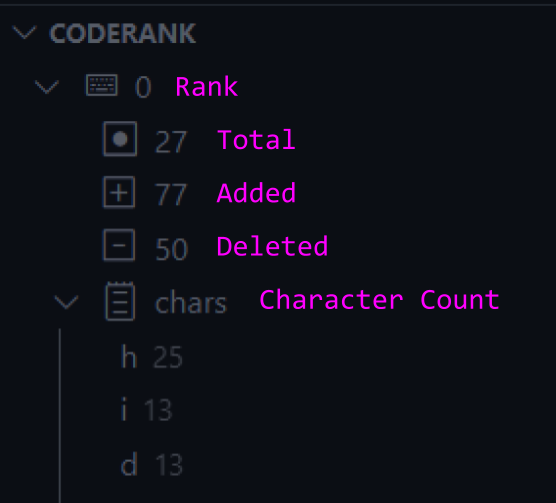

# Coderank

    Curious how many semicolons you typed last week? What about double quotes over the past five years? Want to visualize all your coding data in one place from anywhere? How about present it on your GitHub profile? This extension is for you.
     
     
    <a href="https://github.com/reidspreiter/coderank/issues">Request a Feature</a>
    .
    <a href="https://github.com/reidspreiter/coderank/issues">Report a Bug</a>

## Installation

With VS Code open, search for `coderank` in the extension panel (`Ctrl+Shift+X` on Windows/Linux or `Cmd(⌘)+Shift+X` on MacOS) and click install.

OR

With VS Code open, launch VS Code Quick Open (`Ctrl+P` on Windows/Linux or `Cmd(⌘)+P` on MacOS), paste the following command, and press enter:

`ext install reidspreiter.coderank`

OR

Install this extension from the VS Code Marketplace (coming soon)

## Using Coderank

Thank you for installing Coderank! This document is the best way to get started, and a video presentation is available if needed (coming soon).

Coderank has three simple modes of operation: `project`, `local`, and `remote`. Each mode adds additional functionality to its predecessor.

Coderank is set to `remote` by default. See the [Settings Keys](#settings-keys) section for toggling modes and other behavior.

### Project Mode

Project mode introduces the fundamentals of Coderank by adding a panel to the Explorer section.

- `Added`: amount of characters added overtime via typing, pasting, typing with multiple cursors, etc.

- `Deleted`: amount of characters deleted overtime via pressing backspace, mass deleting, deleting with multiple cursors, etc.

- `Total`: `Added` minus `Deleted`

- `Character Count`: Amount of times each character has been pressed, sorted from most to least pressed

- `Rank`: 1 rank is equal to 10,000 coding actions. While `Added` and `Deleted` account for mass editing actions, `Rank` does not. Typing the letter 'i' and pasting one-million characters at once both count for 0.0001 rank.

Each instance of VS Code is initialized with a new project panel. When a VS Code window is closed, each project field is **deleted**.

Fields are empty at first, but they update automatically after a set amount of typing actions. You can also update project fields manually by clicking the refresh button in the top right of the panel.

### Local Mode

Local mode is an extension of Project mode and adds another section to the Coderank panel.

In local mode, when any workspace file is saved, project field data is automatically saved to VS Code's global filesystem at: 

`<Path-to-VS-Code>/User/globalStorage/reidspreiter.coderank/` 

All VS Code windows contribute data to the same location. Once project fields are saved, they are removed from the project section of the Coderank panel and reflected in the local section.

You can manually add project fields by clicking the local storage button in the top right of the panel.

Coderank organizes data in weekly increments, creating a new `coderank<YYYY>.json` file for each year. Additionally, a `total.json` file is maintained throughout your entire usage of the extension.

Please _avoid editing these files_, or you may experience problems with your extension and potentially lose data.

A compressed backup file is updated every week. If needed, an available backup can be loaded via the `coderank.loadBackup` command.

### Remote Mode

Remote mode is an extension of local mode and adds another section to the Coderank panel.

In remote mode, local data can be pushed to a remote GitHub repository. If you code at home and at work, this is a great way to combine data from multiple computers!

Coderank initializes this repository with a basic web application that displays your data with interactive graphs and charts. Feel free to edit this and make it your own!

You can host your web app on [GitHub Pages](https://pages.github.com/) or other resources so anyone viewing your profile can see your data. Coderank maintains its own directory in your repository, updating data as you please, without impacting your other files.

#### Pushing to GitHub

1. [Create a free GitHub account](https://github.com/).

2. [Create a new repository](https://docs.github.com/en/repositories/creating-and-managing-repositories/quickstart-for-repositories) to store your coderank data. Name it whatever you'd like!

3. Create a GitHub Personal Access Token (PAT). View [this GitHub resource](https://docs.github.com/en/authentication/keeping-your-account-and-data-secure/managing-your-personal-access-tokens), or the [Creating a PAT](#creating-a-pat) section for a Coderank-specific introduction.

4. Make note of the branch names in your repository. Pushing to `main` or `master` is encouraged, but Coderank allows you to push to any branch, as long as it exists.

Upon completing these steps, you are ready to push to your repository!

Press the remote repository button in the top right of the Coderank panel.

You will be prompted to enter your GitHub username, PAT, repository name, and branch name.

Once these fields are supplied, Coderank clones your repository, adds local data to the repository, pushes the changes to GitHub, and deletes all local files and backups if succesful.

Coderank does not save username or PAT credentials for security reasons. However, repository and branch names are saved for convenience.

## Creating a PAT

## Settings Keys

Coderank can be customized by updating the following settings keys in VS Code's `settings.json`.

| Key | Default | Description |
|-----|---------|-------------|
| `coderank.mode` | `"remote"` | Toggle Coderank mode|
| `coderank.refreshRate` | `100` | Automatically refresh project fields every `X` characters. Set to 0 to disable automatic refresh |
| `coderank.trackCharacters` | `true` | Track character values and populate a `Characters Pressed` field |
| `coderank.autoStore` | `true` | Automatically save project fields on document save |
| `coderank.loadLocalOnStart` | `true` | Load fields from local storage when a new window is opened |
| `coderank.debug` | `false` | Logs typing events to the console for debug and development purposes |

